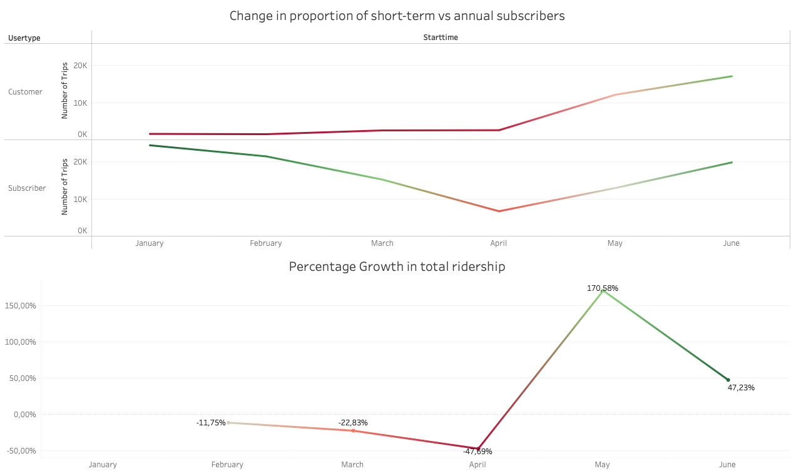
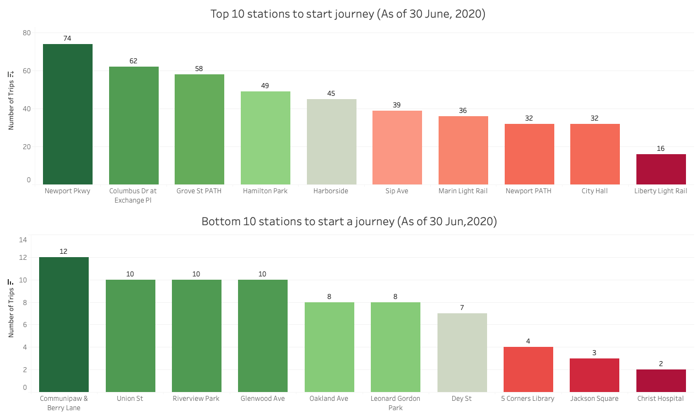
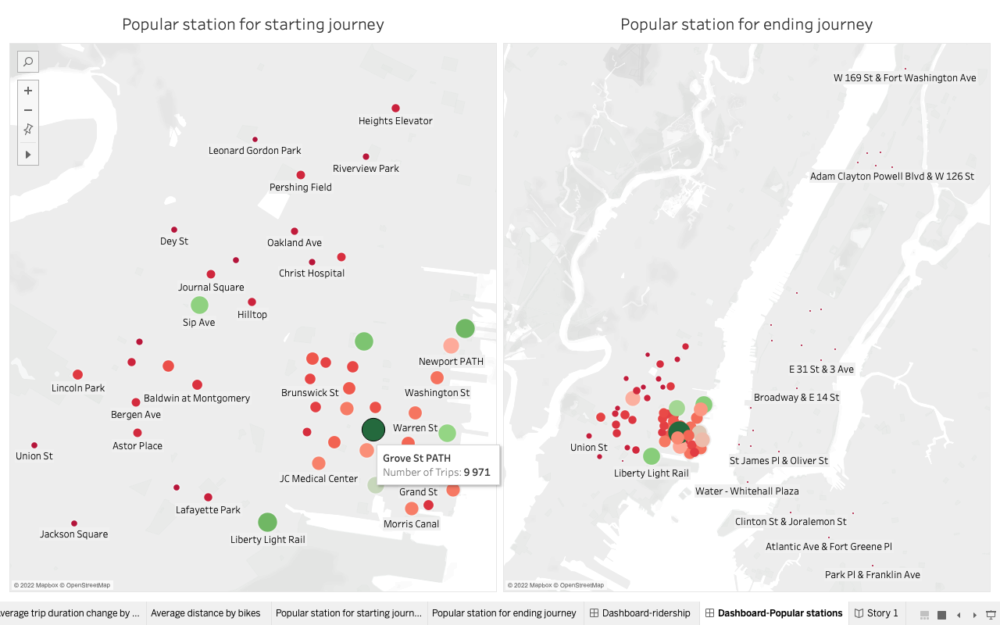

# Tableau - Citi Bike Analysis

## About This Project
This project involves analysing data from the [New York Citi Bike](https://en.wikipedia.org/wiki/Citi_Bike) Program,one of the largest bike sharing program in the United States.

Since 2013, the Citi Bike Program has implemented a robust infrastructure for collecting data on the program's utilization. Through the team's efforts, each month bike data is collected, organized, and made public on the [Citi Bike Data](https://www.citibikenyc.com/system-data) webpage.

However, while the data has been regularly updated, the team has yet to implement a dashboard or sophisticated reporting process. The main aim of this project is to assist city officials, public administrators, and heads of New York City departments to publicize and improve the city program through regular reports. 

## Scope
Data was collected from the Citi Bike Trip History Logs for Quarter 1 and 2 of 2020 ( 1 January to 30 June).

## Data Source
From [Citi Bike Data](https://www.citibikenyc.com/system-data) webpage.

## Visualizations
**Dashboard 1**

https://public.tableau.com/app/profile/clifford.sepato/viz/Citi-bike-Dashboard-1/PercentageGrowthintotalridership

**Dashboard 2**

https://public.tableau.com/app/profile/clifford.sepato/viz/Citi-bike-Dashboard-2/Genderbreakdownofactiveparticipants

## Growth in Total Ridership
There was a sharp increase in rides in May 2020, this could have been as a result of covid-19. As a safety precaution people may have preferred cycling rather taking public transport. There was also an increase in rides taken by customers and subscribers during spring and summer this is because people enjoy outdoor activities such as cycling during warmer seasons. 

## Popular Stations 
As of 30 June 2020,Grove st Path is  the most popular station to start and end a journey .Chris hospital was the least popular station to start a journey based on the number of trips taken.   

## Popular Stations Mapview

